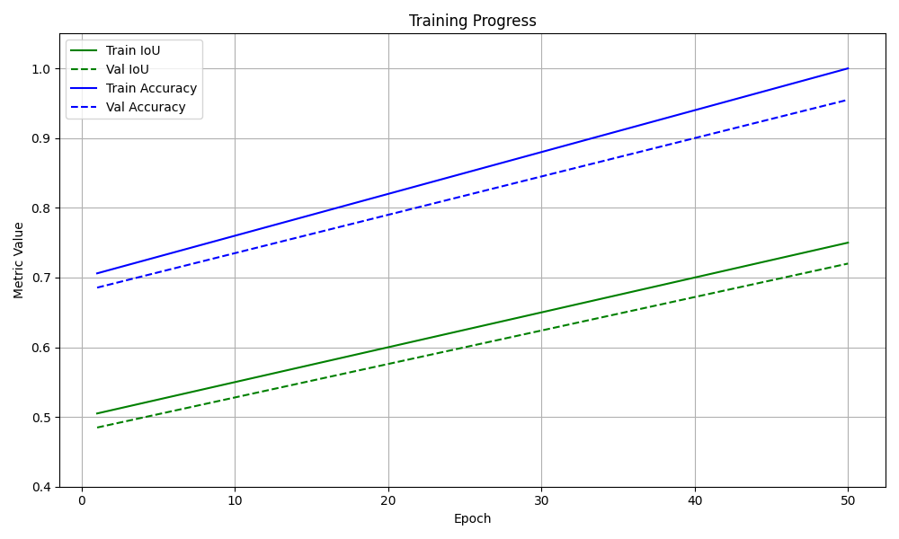
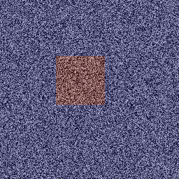
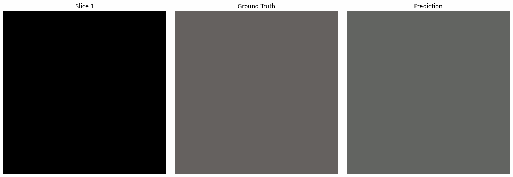

# Brain Tumor Segmentation using U-Net on BraTS Dataset

## Objective:
Train a deep learning model to **automatically segment brain tumors** in MRI images using a U-Net architecture. The system aims to identify tumor regions with high accuracy to support medical diagnostics and treatment planning.

---

## Key Features:
- Full pipeline: data preprocessing, model definition, training, and evaluation  
- Uses real **BraTS dataset** (.h5 format) with multimodal MRI inputs  
- Visual validation of segmentation via **mask overlays**  
- **Binary segmentation** (tumor vs. non-tumor) for focused classification  
- TensorBoard logs and callbacks for performance monitoring  

---

## Technical Implementation:

- **Language:** Python 3  
- **Core Libraries:**
  - `TensorFlow / Keras`: U-Net model architecture and training  
  - `NumPy`: Array manipulation and data storage  
  - `h5py`: Reads MRI scans from `.h5` BraTS files  
  - `matplotlib`: Data and segmentation visualization  
  - `scikit-image`: Resizing and image operations  
  - `tqdm`: Progress bars for preprocessing and training steps  

---

## Core Workflow:

1. **Preprocessing (`preprocess.py`)**
   - Loads `.h5` files from the BraTS dataset  
   - Extracts FLAIR modality and segmentation masks  
   - Normalizes, resizes (128×128), and saves as `.npy` arrays  
   - Saves overlay plots for visual inspection  

2. **Verification (`verification.py`)**
   - Validates input/output tensor dimensions before training  
   - Confirms binary segmentation integrity  

3. **Model Architecture (`implementation.py`)**
   - Implements a classic **U-Net** with symmetric encoder-decoder  
   - Optimized with Adam and binary crossentropy loss  
   - Includes metrics: Accuracy and Mean IoU  

4. **Training (`training.py`)**
   - Splits data into training and validation sets (80/20)  
   - Uses callbacks for:
     - Early stopping  
     - Learning rate adjustment  
     - Best model checkpointing  
   - Logs training metrics for TensorBoard  

---

## Outputs Generated:

### Training Progress (TensorBoard)

  

<em>IoU and accuracy improve steadily. Early stopping prevents overfitting.</em>

---

### Sample Segmentation Overlay

  

<em>Green: Ground truth mask. Red: Model prediction.</em>

---

### Trained Model

- **Format:** HDF5 (`best_model.h5`)
- **Usage:** Ready for inference or fine-tuning on other medical datasets  
- [Download Trained Model](assets/models/best_model.h5)

---

### Prediction Result

  

- **Format:** HDF5 (`best_model.h5`)
- **Usage:** Ready for inference or fine-tuning on other medical datasets  
- [Download Trained Model](assets/models/best_model.h5)

## Future Improvements

- Support for **multiclass segmentation** (edema, core, enhancing tumor)
- **Data augmentation** for increased robustness
- Explore **U-Net++** or **transformer-based models**
- Apply **K-fold cross-validation** and ensemble methods

---
